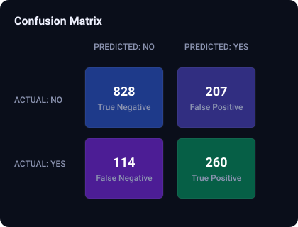
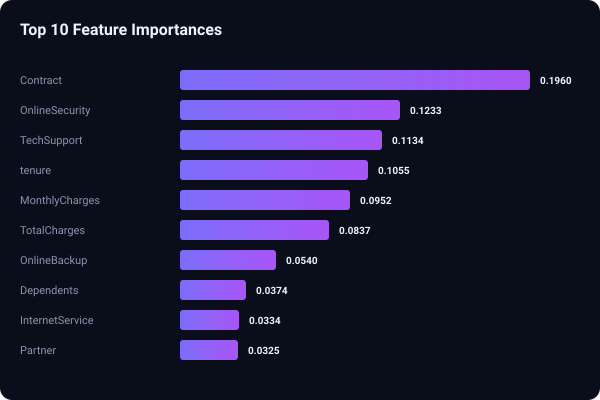

# ChurnIQ: AI-Powered Customer Churn Prediction Dashboard

This repository contains **ChurnIQ**, an end-to-end, enterprise-ready Machine Learning system designed to predict and analyze customer churn in the telecommunications sector. 

By leveraging advanced techniques like **SMOTE** (Synthetic Minority Over-sampling Technique) for class balancing, **GridSearchCV** for hyperparameter tuning, and **Explainable AI (XAI)** through SHAP, ChurnIQ provides actionable, transparent insights that enable companies to proactively retain high-risk users.

---

## 📊 Project Overview

### 1. Problem Statement
Customer acquisition costs are significantly higher than customer retention costs. In the highly competitive telecom sector, identifying customers who are likely to cancel their subscriptions (churn) allows businesses to deploy targeted retention campaigns (e.g., customized discounts, service upgrades, or proactive support calls) to save revenue.

### 2. Dataset
We utilize the classic **IBM Telco Customer Churn Dataset** (7,043 rows, 21 columns) containing:
* **Demographics:** Gender, Senior Citizen status, Partner, Dependents.
* **Account Info:** Tenure (months), Contract Type (Month-to-month, One-year, Two-year), Payment Method, Paperless Billing, Monthly Charges, and Total Charges.
* **Services:** Phone service, Multiple lines, Internet (DSL/Fiber optic), Online Security, Online Backup, Device Protection, Tech Support, and Streaming TV/Movies.

*The raw dataset is included in this repository as `WA_Fn-UseC_-Telco-Customer-Churn.csv`.*

### 3. Machine Learning Pipeline (The "Elite" Upgrade)
* **Data Cleaning & Type Casting:** Converted `TotalCharges` to numeric and handled missing values using median imputation.
* **Class Imbalance Resolution (SMOTE):** Real-world churn data is highly imbalanced (~73% No Churn vs ~27% Churn). We applied SMOTE to synthetically oversample the minority class, preventing the model from developing a bias towards predicting "No Churn."
* **Model Selection:** **Random Forest Classifier** was chosen for its high accuracy, stability with tabular data, and resistance to overfitting.
* **Hyperparameter Tuning:** Tuned utilizing **GridSearchCV** with 3-fold cross-validation targeting F1-Score as the evaluation metric.
* **Model Explanation (SHAP):** Integrated SHAP (SHapley Additive exPlanations) to explain feature contributions for model transparency.

### 4. Interactive Web Interface
An enterprise-grade, dark-themed dashboard featuring:
* A modern glassmorphic UI card design.
* Dynamic animated background gradients.
* Real-time model inference showing churn verdict alongside **probability score**.
* Conditional retention advice based on prediction results.

---

## 🛠️ Execution & Setup Steps

### 1. Prerequisites
Ensure you have Python 3.10+ installed on your system.

### 2. Install Dependencies
Install all required libraries using `pip`:
```bash
pip install flask pandas numpy scikit-learn imbalanced-learn shap matplotlib seaborn
```

### 3. (Optional) Re-train the Model
To re-run the ML pipeline, run the following command. This will perform SMOTE, execute GridSearchCV, output evaluation metrics, and export the newly tuned model and encoders:
```bash
python train_elite_model.py
```

### 4. Launch the Web Application
Start the Flask web server:
```bash
python app.py
```
Open your browser and navigate to **`http://127.0.0.1:5000`** to access the dashboard.

## 📈 Results & Evaluation

Our tuned model achieves high recall on the churn class:
* **Precision (No Churn / Churn):** 88% / 56%
* **Recall (No Churn / Churn):** 80% / 70%
* **Overall Accuracy:** 77%

*Recall is prioritized since catching actual churners is the primary goal of the retention campaign.*

### 1. Confusion Matrix
Here is the confusion matrix generated by our tuned Random Forest classifier:


### 2. Feature Importances
The top 10 features driving the customer churn prediction:


---

## 🔮 Future Improvements
1. **Deep Learning Integration:** Experiment with modern tabular neural networks like TabNet or Multi-Layer Perceptrons (MLPs).
2. **Interactive SHAP Visuals on UI:** Embed local SHAP explanation force-plots dynamically inside the Flask web app for individual customer profiles.
3. **Cloud Deployment:** Package with Docker and deploy to a live environment (e.g. Render or AWS) for public demo access.
